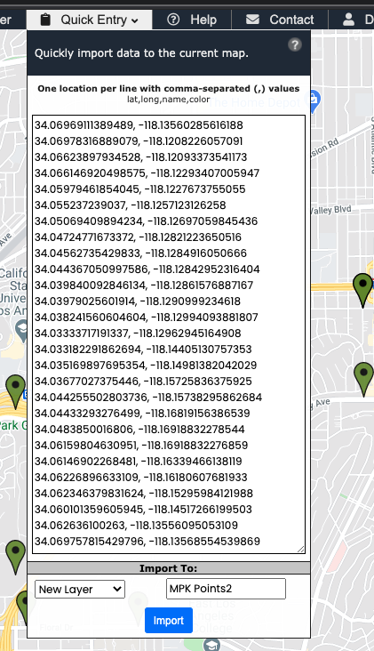
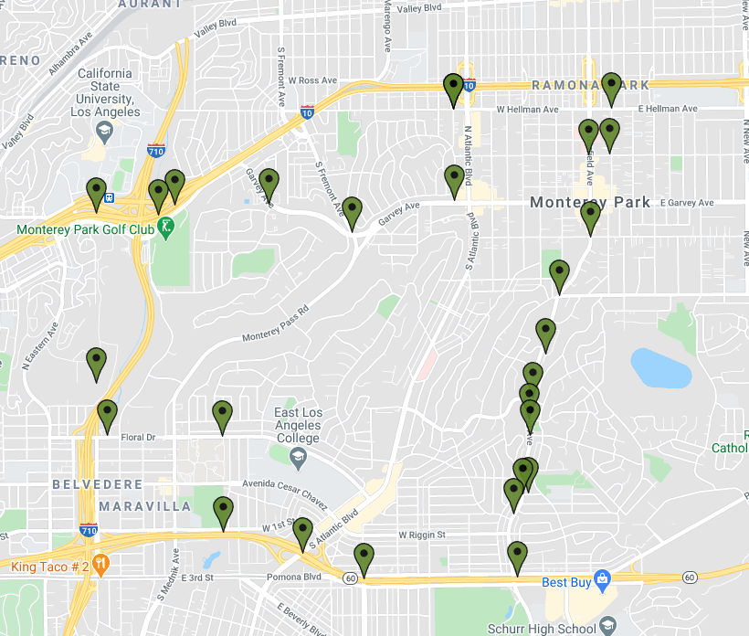
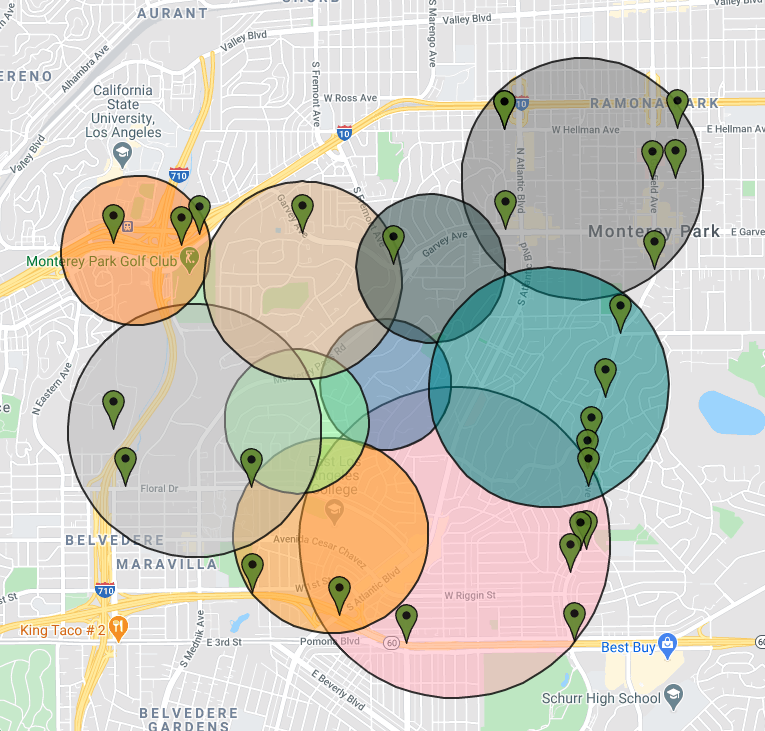
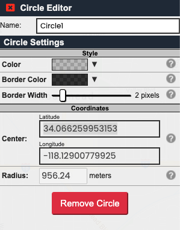
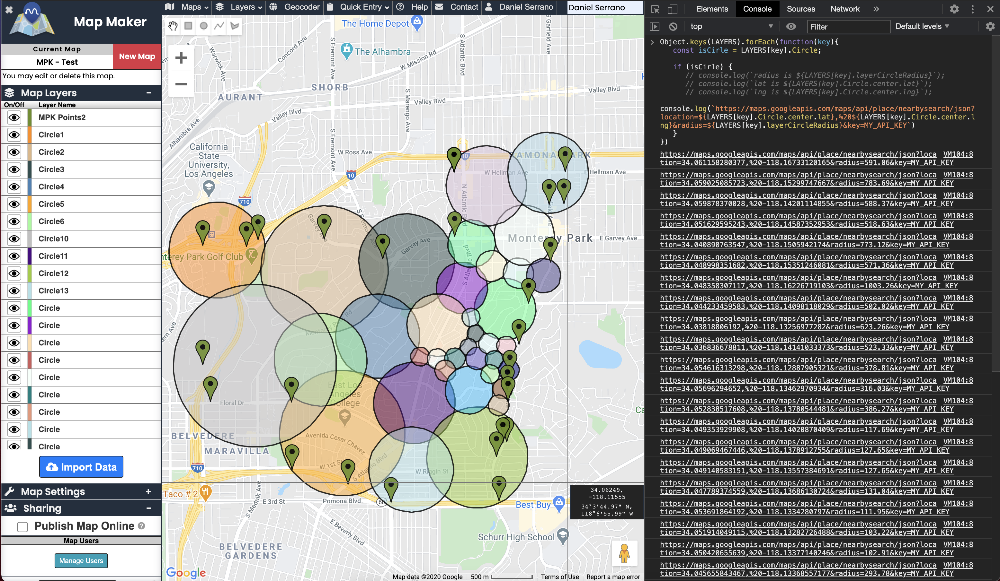

# Google Maps Data

## Step 1: Get Boundries using Python

````python

import requests

url = "https://vanitysoft-boundaries-io-v1.p.rapidapi.com/rest/v1/public/boundary/zipcode"

querystring = {"zipcode":"90011"}

headers = {
    'x-rapidapi-key': "API_KEY",
    'x-rapidapi-host': "vanitysoft-boundaries-io-v1.p.rapidapi.com"
    }

response = requests.request("GET", url, headers=headers, params=querystring)

print(response.text)
````

## Step 2: Navigate to maps.co

Google maps lacks the functionality needed from here, so we move to maps.co, which will allow us to easily get the information we need.

## Step 3: Enter latitude and longtitude data

Once inside maps.co, use the "Quick Entry" tab to past the latitude and longtitude data and click 'import'.



Doing so will produce an outline of the area.



## Step 4: Map out search areas

With an outline in place, use the circle tool to fill the area with circles. The circles in this image as it was just a test, The smaller the better.



## Step 5: Access circle data with in-browser JS

Clicking a circle shows that all the information we need about the circle - it's lat/long center and radius - is contained. This will be sent to google.


<br></br>
But rather than a tedious, error-prone series copy and pasting, we open chrome's developer tools, access the console can use some javascript to scrape the data from the webpage. Running the follow:

````javascript

// scraping function to be used in maps.co
// paste code into console and execute

// 2/8/21 NOTE: Maps.co has changed the way data is stored on the DOM, this function no longer works

const GOOGLE_API_KEY = '';

Object.keys(_LAYERS).forEach(function(key){
    const isCirle = _LAYERS[key].Circle;
 
    if (isCirle) {
       // console.log(`radius is ${_LAYERS[key].layerCircleRadius}`);
       // console.log(`lat is ${_LAYERS[key].Circle.center.lat}`);
       // console.log(`lng is ${_LAYERS[key].Circle.center.lng}`);
       console.log(`https://maps.googleapis.com/maps/api/place/nearbysearch/json?location=${_LAYERS[key].Circle.center.lat},%20${_LAYERS[key].Circle.center.lng}&radius=${_LAYERS[key].circleRadius}&key=${GOOGLE_API_KEY}`)
    }
 })

````

will produce a series of strings like those in the image below. These can then be used to make api calls that will return the business data that we can then use the logic currently located in data_clean.js to sanitize.
<br></br>

<br></br>
Note: for <a href='https://developers.google.com/places/web-service/search#PlaceSearchRequests'>Nearby Search requests</a> return a max of 60 results per request, so search dimensions need to be small so this limit is not reached. Most the search radiuses in the previous image are far too large and are intended for demonstration reasons only.